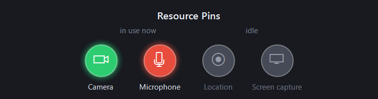

# Resource Pins

Privacy indicators for Windows. Small pins show which sensitive resources are in use right now, and which app is using them.



| Pin | Resource | Color when lit |
|-----|----------|----------------|
| 📷 | Camera | Green |
| 🎤 | Microphone | Red |
| 📍 | Location | Blue |
| 🖥️ | Screen capture | Purple |

Pins show up in two places, and you pick which ones you want from the tray menu:

- **On-screen overlay** — four 16px dots in the top-right corner, similar to an FPS counter. Always visible: translucent gray when idle, colored and glowing when in use.
- **Taskbar** — one notification area icon per resource, present only while that resource is in use.

Hover either one to see which app is responsible.

## What it detects, and what it doesn't

Windows keeps a record in `CapabilityAccessManager\ConsentStore` of which apps access each resource. An app counts as in use when its entry has `LastUsedTimeStart > 0` and `LastUsedTimeStop == 0`. Resource Pins polls that once per second. No hooks, no drivers, no elevation, negligible CPU cost.

The consequence is that the app only sees what Windows records.

**Detected:** camera and microphone for essentially any app (browsers, Discord, Teams, OBS, games), and screen sharing through the modern **Windows.Graphics.Capture** API — Teams, Discord, Meet, Chrome, Edge, Snipping Tool.

**Not detected:** screen capture through lower-level APIs such as **DXGI Desktop Duplication**, which do not go through the Windows permission system. In practice this includes OBS Studio's Display Capture: OBS shows up correctly on the camera and microphone pins, but the screen capture pin stays dim while it records your screen that way. This is a limit of the data source, not a bug, and there is no fix without ETW or a driver.

In short: trust the purple pin to answer "is someone seeing my screen in a call?". Don't treat it as a recorder detector.

Worth knowing: Windows 11 already shows its own camera and microphone indicator in the tray. What this project adds is seeing all four resources at once, always in view.

## Install

Download the installer from [Releases](../../releases) and run it.

The installer is **not code signed** — a signing certificate costs a few hundred dollars a year, which is hard to justify for a free utility. SmartScreen will show "Windows protected your PC"; choose **More info → Run anyway**. If you would rather not trust a third-party binary, build it yourself: four source files, no external dependencies.

It installs to `%LOCALAPPDATA%\Programs\ResourcePins`, needs no administrator rights, and can optionally start with Windows.

## Build

```
dotnet publish -c Release
```

Requires the [.NET 10 SDK](https://dotnet.microsoft.com/download). The publish is self-contained (win-x64), so the output runs on machines without .NET installed.

To build the installer, with [Inno Setup 6](https://jrsoftware.org/isdl.php):

```
iscc installer.iss
```

## Usage

The tray icon (a shield with an eye) sits in the notification area. On Windows 11 it starts in the hidden icons flyout behind the `^` chevron; drag it out to keep it visible. Right-click for:

- **Show in taskbar** — toggle the per-resource icons
- **Show on-screen pins** — toggle the corner overlay
- **Test mode** — light up every pin, useful for checking placement
- **Open diagnostic log** — written to `%APPDATA%\ResourcePins\log.txt`

Display limitation: games running in *exclusive* fullscreen cover any ordinary overlay. Windowed and borderless modes are fine, and the taskbar icons work regardless.

## Privacy

The app reads the local registry and the list of running processes. It makes no network connections, sends nothing anywhere, and keeps no usage history. The only files it writes are the diagnostic log and your preferences, both under `%APPDATA%\ResourcePins`.

## Contributing

Bug reports and pull requests are welcome. See [CONTRIBUTING.md](CONTRIBUTING.md).

## Roadmap

See [ROADMAP.md](ROADMAP.md). The main item for v2 is blocking an app's access to a resource from the pin itself.

## License

MIT — see [LICENSE](LICENSE).
